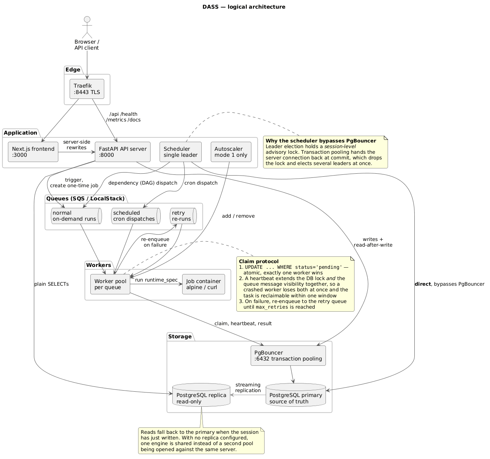
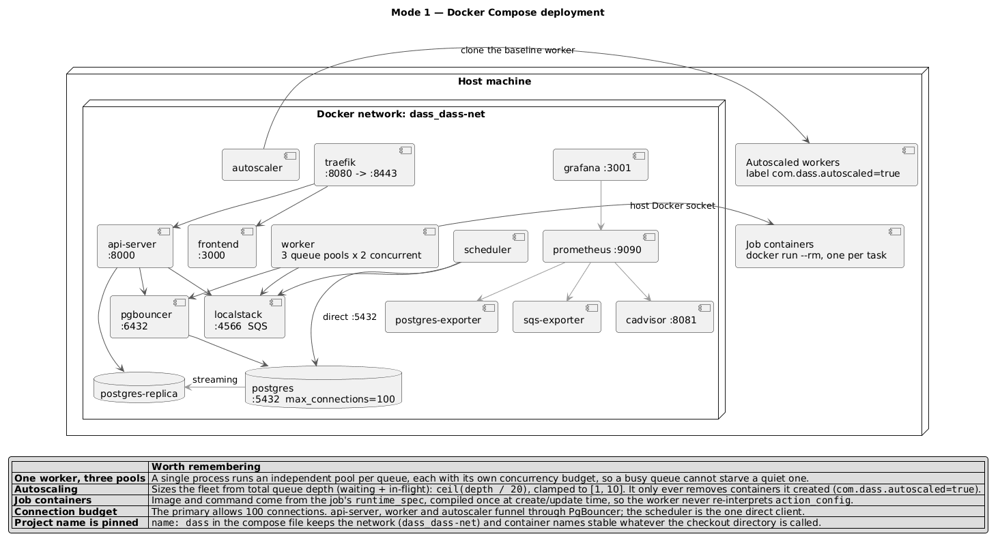
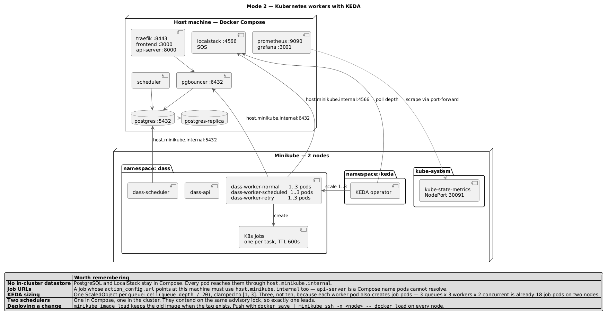
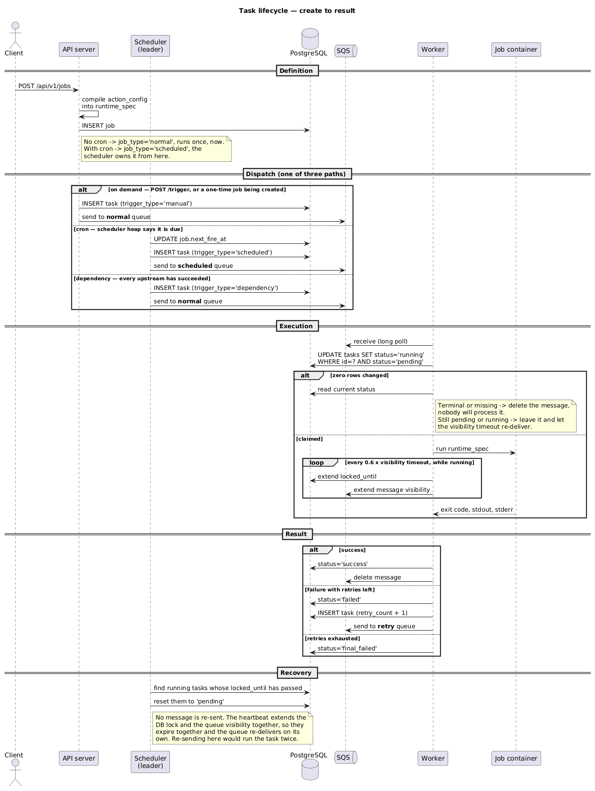
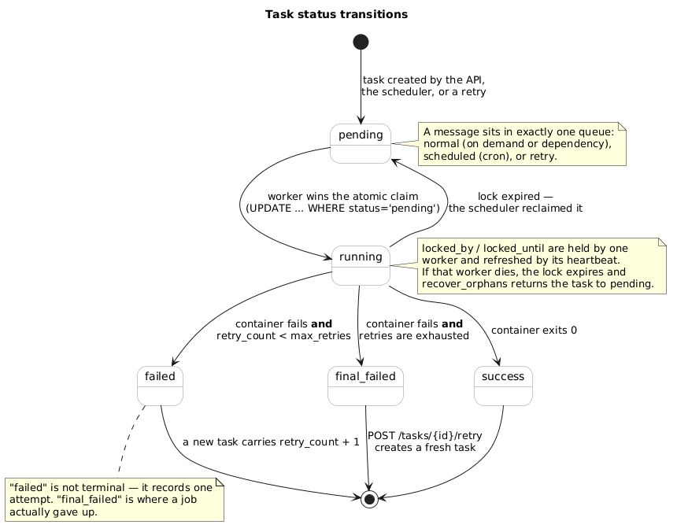

# Architecture reference

A fast way back into this codebase — for a person returning after a break, and for an
agent that needs to find the right module without reading everything.

Each diagram has a `.puml` source and a rendered `.png` in [`diagrams/`](diagrams).
The sources carry the reasoning, not just the boxes: the constraints below cannot be
recovered from the shape of the code alone, and getting them wrong is how this system
breaks.

Regenerate the images after editing any source:

```bash
./docs/render-diagrams.sh
```

---

## 1. Logical architecture



What talks to what, and which database endpoint each component is allowed to use.

| Element | Implementation |
|---|---|
| API server | `backend/app/main.py`, `backend/app/api/v1/` |
| Scheduler | `backend/app/cli.py` (`run_scheduler`, `LeaderLock`), `backend/app/scheduler/` |
| Worker | `backend/app/cli.py` (`run_worker`, `_run_queue_pool`), `backend/app/services/worker_service.py` |
| Read/write split | `backend/app/db/session.py` (`RoutingSession`, `force_primary`) |
| Queues | `backend/app/queue/`, `backend/app/queue/factory.py` |
| Autoscaler | `backend/app/services/autoscaler_service.py`, `backend/app/services/vm_service.py` |

---

## 2. Mode 1 — Docker Compose



Everything in Compose, including the worker. Started by `./infra/start-mode1.sh`.

| Element | Implementation |
|---|---|
| Service topology | `docker-compose.yml`, `docker-compose.local.yml` |
| Observability overlay | `docker-compose.observability.yml`, `infra/observability/` |
| Job execution | `backend/app/services/execution_service.py` (`docker run`) |
| Worker fleet sizing | `backend/app/services/vm_service.py` |
| PgBouncer | `pgbouncer.ini`, `Dockerfile.pgbouncer` |
| Replication bootstrap | `infra/postgres/init-primary/`, `infra/postgres/init-replica/` |

---

## 3. Mode 2 — Kubernetes workers with KEDA



Infrastructure stays in Compose; workers become Deployments scaled by queue depth.
Started by `./infra/start-mode2.sh`.

| Element | Implementation |
|---|---|
| Manifests | `infra/k8s/` |
| Scaling rules | `infra/k8s/09-keda-scaledobject.yaml` |
| Cluster configuration | `infra/k8s/01-configmap.yaml` |
| Job execution | `backend/app/services/kubernetes_execution_service.py` |
| Backend selection | `backend/app/services/execution_factory.py` |

---

## 4. Task lifecycle



The sequence from `POST /jobs` to a recorded result, including the three dispatch
paths, the claim protocol, retries and orphan recovery. Any change to the worker or
scheduler has to preserve this ordering.

| Step | Implementation |
|---|---|
| Compile `action_config` into `runtime_spec` | `backend/app/services/job_service.py` (`_build_runtime_spec`) |
| Cron dispatch | `backend/app/scheduler/cron_scheduler.py` |
| Dependency dispatch | `backend/app/scheduler/dependency_scheduler.py` |
| Atomic claim and heartbeat | `backend/app/services/worker_service.py` |
| Retry and terminal states | `backend/app/services/worker_service.py` (`_handle_failure`) |
| Orphan recovery | `backend/app/scheduler/cron_scheduler.py` (`recover_orphans`) |

---

## 5. Task states



The only legal transitions. `failed` records one attempt; `final_failed` is where a
job actually gave up.

Defined in `backend/app/models/task.py` and enforced in
`backend/app/repositories/task_repository.py`.

---

## Invariants worth re-reading before changing anything

1. **The scheduler must connect to PostgreSQL directly.** Leader election holds a
   session-level advisory lock; PgBouncer's transaction pooling returns the server
   connection at commit and would elect several leaders at once.
   *`backend/app/cli.py`, `docker-compose.yml`, `infra/k8s/06-scheduler.yaml`*

2. **The DB lock and the queue visibility are extended together.** They must expire
   together, so a crashed worker's task becomes reclaimable within one visibility
   window rather than one job duration. Recovery never re-sends the message — the
   queue re-delivers on its own, and re-sending would run the task twice.
   *`backend/app/services/worker_service.py`, `backend/app/scheduler/cron_scheduler.py`*

3. **A task is claimed with a conditional UPDATE, never a read-then-write.**
   `UPDATE ... WHERE status='pending'` is what makes duplicate execution impossible.
   *`backend/app/services/worker_service.py` (`claim_task`)*

4. **Read-after-write pins to the primary.** Any session that has just written must
   not read from the replica; lag would hide the row it created.
   *`backend/app/db/session.py`*

5. **Connection pools are sized per role, and both engines use the same profile.**
   The primary allows 100 connections; a worker pod that opens an unbounded replica
   pool exhausts it as soon as KEDA scales out.
   *`backend/app/db/session.py` (`_POOL_PROFILES`)*

6. **A downstream job fires once per generation of upstream completions.** With a
   diamond (A→C, B→C) both upstreams finishing must produce exactly one run of C.
   *`backend/app/scheduler/dependency_scheduler.py`*

7. **On-demand runs are `trigger_type='manual'`.** `'scheduled'` is reserved for the
   scheduler, and the Grafana dispatch panels count on that distinction.
   *`backend/app/services/job_service.py`*

8. **Every Compose command uses the same set of `-f` files.** A different combination
   makes Compose recreate `postgres` and `localstack`, which on a first run interrupts
   initdb partway through the replication setup.
   *`infra/lib.sh`*

9. **`minikube image load` does not replace an existing tag.** Deploy a code change
   with `docker save | minikube ssh -n <node> -- docker load` on every node, or you
   will be running the previous build with nothing to tell you.
   *`infra/lib.sh` (`load_image_into_minikube`)*
